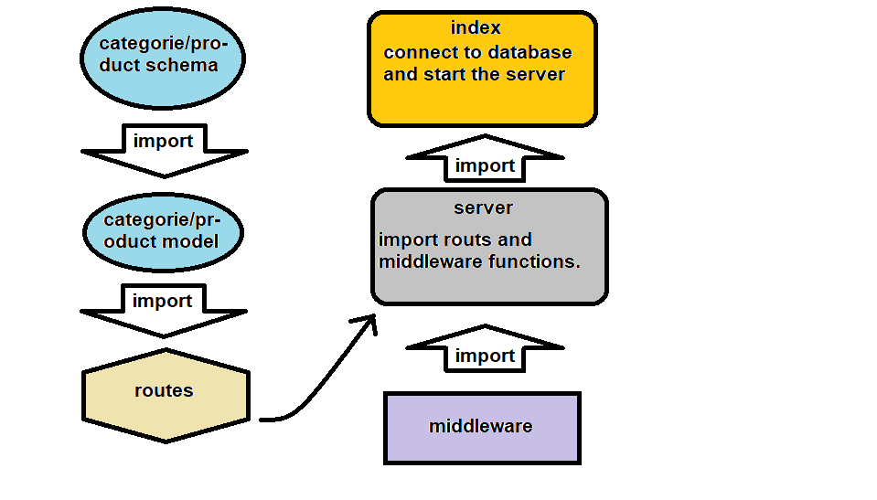

# 401-final-api

## Final-API-Server

### Author: obada alquran

### Links and Resources

- [submission PR](https://github.com/obadeh/401-lab-10-final-API/pull/1)
- [ci/cd](https://github.com/obadeh/401-lab-10-final-API/actions) (GitHub Actions)

### Setup

#### `.env` requirements (where applicable)

i.e.

- `PORT` - 3000
- `MONGODB_URI` - MONGODB_URI=mongodb://localhost:27017/lab-10-db

#### How to initialize/run your application (where applicable)

- e.g. `npm start`

#### Tests

- How do you run tests? `npm test`
- Any tests of note?
- Describe any tests that you did not complete, skipped, etc

#### UML

